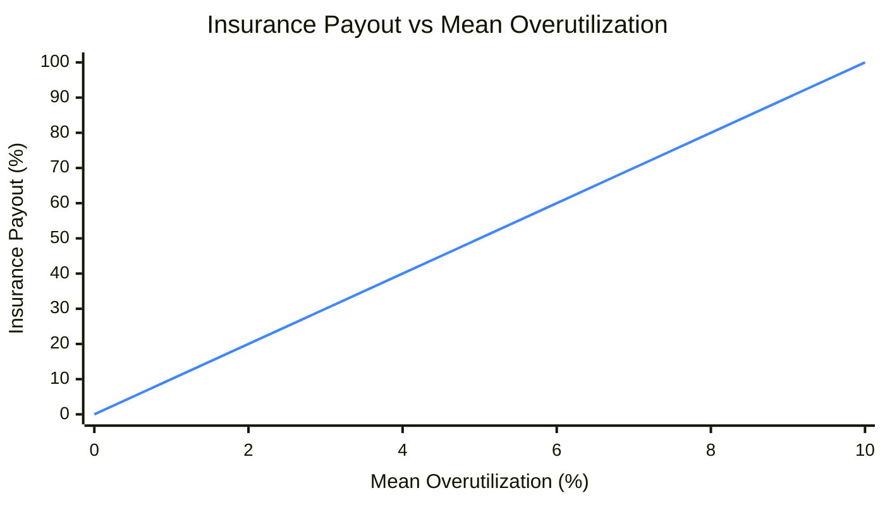
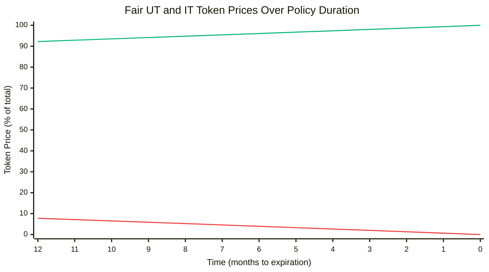
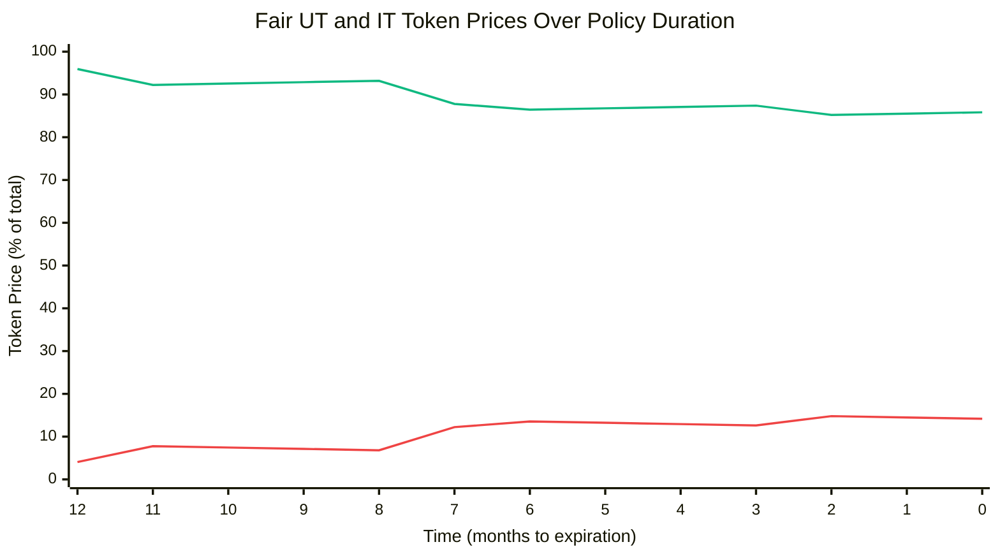

# Example: Lending Vault Overutilization

In this example policy, Insurance Token holders are owed a claim after settlement proportional to the overall overutilzation of a lending vault over the policy period. Given a utilization target `T < 100%`.
- If the vault never crosses the utilization target throughout the policy period, the insurance payout is 0.
- If the vault is at 100% utilization for the full policy period, the insurance payout is 100% of the assets underwriting the policy.
- If the mean overutilization is U where `0% < U < 100% - T`, the insurance payout is `U / (100% - T)`.

## Payout Ratio



*Assuming a 90% utilization target*

## Policy Contract

Assuming:
- An oracle can determine the mean overutilization for a time period
- A function `meanOverutilizatoin(uint256 start, uint256 end) external view returns (uint256)` returns said value

```solidity
abstract contract Policy is ICassaPolicy {
    uint256 public constant utilizationTarget = 9e17; // 90% (0.9 * 1e18)

    function meanOverutilization(uint256 start, uint256 end) external view returns (uint256);

    function settlementRatio() external view returns (uint256 ratio, bool settled, bool ok) {
        uint256 start = effectiveDate();
        uint256 end = Math.min(block.timestamp, expirationDate());
        ratio = Math.mulDiv(1e18, meanOverutilization(start, end), 1e18 - utilizationTarget);
        settled = end == expirationDate();
        return (ratio, settled, true);
    }
}
```

## Price Modeling

Below are models for the expected fair market price of IT and UT as the policy period elapses. Note these are expected free market prices, not prices enforced by the protocol.

- 1 year policy duration.
- Expected overutilization for the remainder of the policy remains at a constant 5% (high) and is modeled as a single point estimate, not a probability distribution. Prices can be interpreted as the median (50th percentile) outcome, not accounting for variance or tail risk.
- Effects of available liquidity are not accounted for.
- Underwriters are assumed to require at least a 3% risk-adjusted annualized yield on their position to underwrite the policy, thus setting a price ceiling on UT at any given time regardless of performance or expectations.

### Scenario I

No overutilization.

| Time (months) | Util | Over-util | Cum. Over-util | Exp. Cum. Over-util at Expr. | Fair UT Price | Fair IT Price |
|---------------|------|-----------|----------------|------------------------------|---------------|---------------|
| T-12 |  |  | 0% | 5% | 0.9223 | 0.0777 |
| T-11 | 89% | 0% | 0% | 5% | 0.9287 | 0.0713 |
| T-10 | 88% | 0% | 0% | 4% | 0.9350 | 0.0650 |
| T-9 | 87% | 0% | 0% | 4% | 0.9414 | 0.0586 |
| T-8 | 88% | 0% | 0% | 3% | 0.9478 | 0.0522 |
| T-7 | 89% | 0% | 0% | 3% | 0.9542 | 0.0458 |
| T-6 | 90% | 0% | 0% | 3% | 0.9607 | 0.0393 |
| T-5 | 90% | 0% | 0% | 2% | 0.9672 | 0.0328 |
| T-4 | 90% | 0% | 0% | 2% | 0.9737 | 0.0263 |
| T-3 | 90% | 0% | 0% | 1% | 0.9802 | 0.0198 |
| T-2 | 90% | 0% | 0% | 1% | 0.9868 | 0.0132 |
| T-1 | 90% | 0% | 0% | 0% | 0.9934 | 0.0066 |
| T-0 | 90% | 0% | 0% | 0% | 1.0000 | 0.0000 |

#### Token Price Over Time



*UT price (green) increases as time passes without overutilization, while IT price (red) decreases. With constant 5% expected overutilization, the likelihood of significant overutilization by the end of the policy period decreases over time.*

### Scenario II

Some overutilization.

| Time (months) | Util | Over-util | Cum. Over-util | Exp. Cum. Over-util at Expr. | Fair UT Price | Fair IT Price |
|---------------|------|-----------|----------------|------------------------------|---------------|---------------|
| T-12 |  |  | 0% | 5% | 0.9595 | 0.0405 |
| T-11 | 95% | 5% | 5% | 10% | 0.9223 | 0.0777 |
| T-10 | 85% | 0% | 5% | 9% | 0.9255 | 0.0745 |
| T-9 | 85% | 0% | 5% | 9% | 0.9287 | 0.0713 |
| T-8 | 90% | 0% | 5% | 8% | 0.9319 | 0.0681 |
| T-7 | 97% | 7% | 12% | 15% | 0.8778 | 0.1222 |
| T-6 | 92% | 2% | 14% | 17% | 0.8645 | 0.1355 |
| T-5 | 90% | 0% | 14% | 16% | 0.8676 | 0.1324 |
| T-4 | 90% | 0% | 14% | 16% | 0.8707 | 0.1293 |
| T-3 | 90% | 0% | 14% | 15% | 0.8739 | 0.1261 |
| T-2 | 93% | 3% | 17% | 18% | 0.8521 | 0.1479 |
| T-1 | 90% | 0% | 17% | 17% | 0.8552 | 0.1448 |
| T-0 | 90% | 0% | 17% | 17% | 0.8583 | 0.1417 |

#### Token Price Over Time



*UT and IT prices fluctuate as utilization varies over time*
