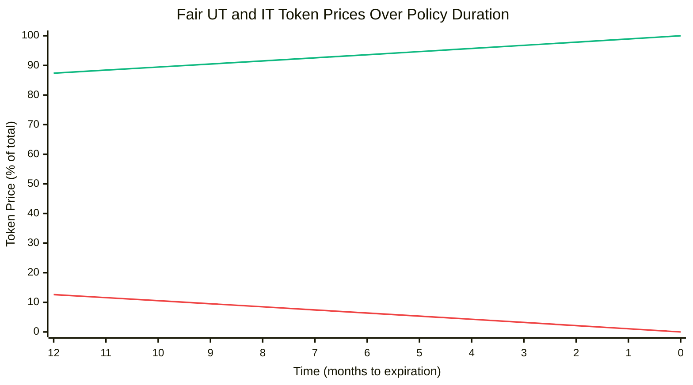
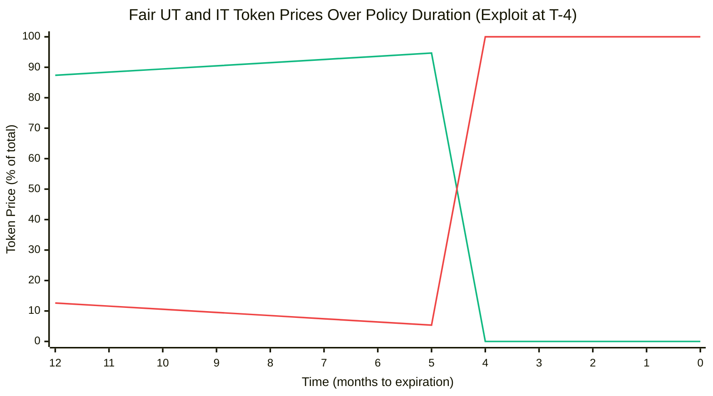

# Example: Protocol Exploit Policy

In this example policy, Insurance Token holders are owed a claim after settlement of the maximum 100% if a protocol has suffered an exploit that meets certain characteristics.
- If such an exploit has take place, the payout is 100% of the assets underwriting the policy.
- Otherwise, it's 0%.

## Payout Ratio

| Exploit Status | Insurance Payout |
|:---------------|:-----------------|
| No Exploit     | 0%               |
| Exploit Occurred | 100%           |

*Binary payout: insurance pays out the full amount only if a qualifying exploit has occurred during the policy period.*

## Policy Contract

Assuming:
- An oracle or dispute resolution mechanism can determine if a qualifying exploit has occurred
- A function `hasExploitOccurred() external view returns (bool)` returns the exploit status

```solidity
abstract contract Policy is ICassaPolicy {
    function hasExploitOccurred() external view virtual returns (bool);

    function settlementRatio() external view returns (uint256 ratio, bool settled, bool ok) {
        if (block.timestamp < expirationDate()) {
            return (0, false, false);
        }
        ratio = hasExploitOccurred() ? 1e18 : 0;
        return (ratio, true, true);
    }
}
```

## Price Modeling

Below are models for the expected fair market price of IT and UT as the policy period elapses. Note these are expected free market prices, not prices enforced by the protocol.

- 1 year policy duration.
- Expectations of the likelihood of qualifying exploit in a given year remain at a constant 10% (very high). Therefore, as the time remaining in the policy decreases without there being an exploit, the likelihood that there will have been one by the expiration date decreases and the IT price goes down.
- Effects of available liquidity are not accounted for.
- Underwriters are assumed to require at least a 3% risk-adjusted annualized yield on their position to underwrite the policy, thus setting a price ceiling on UT at any given time regardless of performance or expectations.

### Scenario I

No qualifying exploit happen.

| Time (months) | Fair UT Price | Fair IT Price |
|---------------|---------------|---------------|
| T-12 | 0.8738 | 0.1262 |
| T-11 | 0.8841 | 0.1159 |
| T-10 | 0.8944 | 0.1056 |
| T-9 | 0.9047 | 0.0953 |
| T-8 | 0.9151 | 0.0849 |
| T-7 | 0.9256 | 0.0744 |
| T-6 | 0.9361 | 0.0639 |
| T-5 | 0.9466 | 0.0534 |
| T-4 | 0.9572 | 0.0428 |
| T-3 | 0.9678 | 0.0322 |
| T-2 | 0.9785 | 0.0215 |
| T-1 | 0.9892 | 0.0108 |
| T-0 | 1.0000 | 0.0000 |

#### Token Price Over Time



*UT price (green) increases as time passes without an exploit, while IT price (red) decreases. With constant 10% annual exploit probability, the likelihood of an exploit occurring in the remaining policy period decreases over time.*

### Scenario II

Qualifying exploit happens in T-4.

| Time (months) | Fair UT Price | Fair IT Price |
|---------------|---------------|---------------|
| T-12 | 0.8738 | 0.1262 |
| T-11 | 0.8841 | 0.1159 |
| T-10 | 0.8944 | 0.1056 |
| T-9 | 0.9047 | 0.0953 |
| T-8 | 0.9151 | 0.0849 |
| T-7 | 0.9256 | 0.0744 |
| T-6 | 0.9361 | 0.0639 |
| T-5 | 0.9466 | 0.0534 |
| T-4 | 0.0000 | 1.0000 |
| T-3 | 0.0000 | 1.0000 |
| T-2 | 0.0000 | 1.0000 |
| T-1 | 0.0000 | 1.0000 |
| T-0 | 0.0000 | 1.0000 |

#### Token Price Over Time



*At T-4, a qualifying exploit occurs causing an immediate price flip: UT drops to 0% and IT jumps to 100%. The prices remain locked at these values through expiration since the payout is now certain.*
