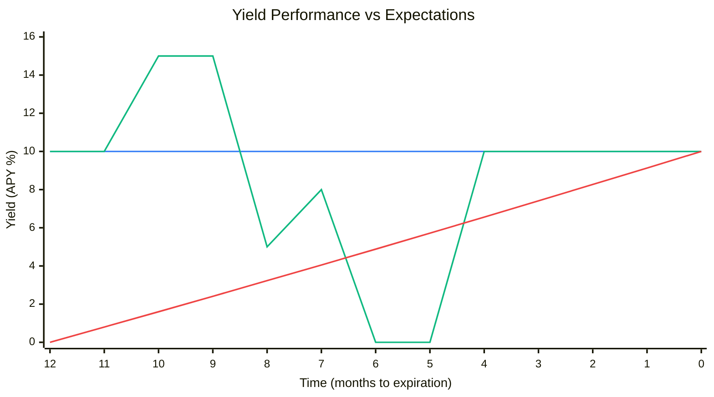

# Example: Yield Underperformance Policy

In this example policy, Insurance Token holders are owed a claim after settlement proportional to a DeFi protocol's yield underperformance beyond a certain threshold throughout the duration of the policy.
- If the overall yield is at or over the threshold, the insurance payout is 0.
- If the overall yield is 0%, the insurance payout is 100% of the assets underwriting the policy.
- If the overall yield is greater than 0%, but under the threshold, the payout is `1 - yield / threshold`.

## Payout Ratio


*Assuming a 10% yield threshold*

## Policy Contract

Assuming:
- Yield is distributed in the form of the appreciation of a yield-bearing token
- We can access the redemption price of the token at an arbitrary time with a function `priceAt(uint256 timestamp)  external view returns (uint256 price)`

```solidity
abstract contract Policy is ICassaPolicy {
    uint256 public constant yieldThreshold = 1e17; // 10% (0.1 * 1e18)

    function priceAt(uint256 timestamp) external view virtual returns (uint256 price);

    function settlementRatio() external view returns (uint256 ratio, bool settled, bool ok) {
        if (block.timestamp < expirationDate()) {
            return (0, false, false);
        }
        uint256 policyPeriodYield = Math.max(1e18, Math.mulDiv(1e18, priceAt(expirationDate()), priceAt(effectiveDate()))) - 1e18;
        ratio = 1e18 - Math.mulDiv(1e18, Math.min(yieldThreshold, policyPeriodYield), yieldThreshold);
        return (ratio, true, true);
    }
}
```

## Price Modeling

Below are models for the expected fair market price of IT and UT as the policy period elapses and yield expectations fluctuate. Note these are expected free market prices, not prices enforced by the protocol.

- 1 year policy duration.
- Expectations of future yield fluctuate over time and are modeled as a single point estimate, not a probability distribution. Prices can be interpreted as the median (50th percentile) outcome, not accounting for variance or tail risk.
- Effects of available liquidity are not accounted for.
- Underwriters are assumed to require at least a 3% risk-adjusted annualized yield on their position to underwrite the policy, thus setting a price ceiling on UT at any given time regardless of performance or expectations.

### Scenario I

Yield exceeds threshold by end of policy, with expectations fluctuating over time.

| Time (months) |  Realized APY |  Expected Future APY |  Cum. Realized APY |  Expected Realized APY at Expr. |  Fair UT Price |  Fair IT Price |
|---------------|---------------|----------------------|--------------------|---------------------------------|----------------|----------------|
| T-12 |      |  10% |  0.00% |  10.00% |  0.9709 |  0.0291 |
| T-11 |  10% |  10% |  0.80% |  10.00% |  0.9733 |  0.0267 |
| T-10 |  10% |  15% |  1.60% |  14.15% |  0.9757 |  0.0243 |
| T-9 |  10% |  15% |  2.41% |  13.73% |  0.9781 |  0.0219 |
| T-8 |  10% |  5% |  3.23% |  6.64% |  0.6511 |  0.3489 |
| T-7 |  10% |  8% |  4.05% |  8.83% |  0.8678 |  0.1322 |
| T-6 |  10% |  0% |  4.88% |  4.88% |  0.4809 |  0.5191 |
| T-5 |  10% |  0% |  5.72% |  5.72% |  0.5647 |  0.4353 |
| T-4 |  10% |  10% |  6.56% |  10.00% |  0.9902 |  0.0098 |
| T-3 |  10% |  10% |  7.41% |  10.00% |  0.9926 |  0.0074 |
| T-2 |  10% |  10% |  8.27% |  10.00% |  0.9951 |  0.0049 |
| T-1 |  10% |  10% |  9.13% |  10.00% |  0.9975 |  0.0025 |
| T-0 |  10% |  10% |  10.00% |  10.00% |  1.0000 |  0.0000 |

#### Yield Expectations Over Time



*Threshold (blue) is constant at 10%. Expected yield at expiration (green) fluctuates based on market sentiment. Cumulative realized yield (red) steadily increases. When expected yield drops below threshold (T-6 to T-7), IT prices spike as insurance becomes more valuable.*

#### Token Price Over Time


*UT tokens (green) represent underwriter value, IT tokens (red) represent insurance value. Prices fluctuate based on expected yield outcomes.*


